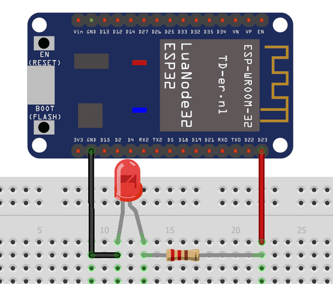

# ESP32-RECEPTION-ORDRE-PAGE-WEB-UBUNTU-
# 🔌 TP ESP32 – Commande d’actionneurs via Web

---

## 🎯 Objectif

Ce TP permet de :
- Contrôler une **LED et un buzzer** avec une ESP32
- Envoyer des commandes depuis une page web (PHP)
- Comprendre le fonctionnement IoT (Web → ESP32 → Actionneur)

---

# 🖥️ Étape 1 : Ajouter des boutons dans `index.php`

📁 Fichier :
```
/var/www/html/btsciel/index.php
```

---

## 🔧 Code à ajouter dans `<body>`

⚠️ Garder la partie mesure existante

```html
<body>

    <!-- PARTIE MESURE A LAISSER -->

    <h1>Commande ESP32</h1>

    <!-- Bouton ALLUMER -->
    <button onclick="fetch('http://IP_ESP32/son')">
        Allumer
    </button>

    <!-- Bouton ETEINDRE -->
    <button onclick="fetch('http://IP_ESP32/led')">
        Éteindre
    </button>

</body>
```

---

## ✅ Validation

✔ Tester les boutons  
✔ Vérifier que l’ESP32 reçoit les requêtes  
✔ Valider avec le professeur  

---

# ⚙️ Étape 2 : Ajouter des actionneurs sur l’ESP32

## 🎯 Objectif

- Tester un **buzzer**
- Tester une **LED**
- Réagir aux commandes envoyées depuis le navigateur

---

## 🧰 Matériel

- ESP32
- Grove buzzer
- LED
- Résistance (220Ω recommandé)
- Breadboard
- Fils de connexion

---

# 🔊 1. Buzzer

## 🔌 Branchement

| Buzzer | ESP32 |
|--------|------|
| VCC    | 3.3V |
| GND    | GND  |
| SIG    | GPIO 26 |

---

## 💻 Code ESP32 (buzzer)

```cpp
const int buzzer = 23;

void setup() {
  ledcAttach(buzzer, 2000, 8);   // canal PWM
}

void loop() {
  ledcWriteTone(buzzer, 262); // Do
  delay(300);

  ledcWriteTone(buzzer, 294); // Ré
  delay(300);

  ledcWriteTone(buzzer, 330); // Mi
  delay(300);

  ledcWriteTone(buzzer, 0);   // stop
  delay(1000);
}
```

## ⚠️ Attention

- Si aucun son → vérifier câblage
- Si problème → appeler le professeur

---

# 💡 2. LED

## 🔌 Branchement

| LED | ESP32 |
|-----|------|
| Anode (+) | GPIO (ex : 25) |
| Cathode (-) | GND via résistance 220Ω |
## Faire comme image si-dessous


---

## 🎯 Objectif LED

- Allumer la LED via :
  ```
  http://IP_ESP32/son
  ```
- Éteindre la LED via :
  ```
  http://IP_ESP32/led
  ```

---

# 🌐 Fonctionnement global

```
Page Web (PHP)
     ↓
HTTP fetch()
     ↓
ESP32
     ↓
Buzzer / LED
```

---

# 🚀 Résultat attendu

✔ Boutons web fonctionnels  
✔ ESP32 reçoit les requêtes  
✔ LED contrôlée à distance  
✔ Buzzer qui joue un son  

---

# 🔥 Améliorations possibles

- Ajouter un bouton “toggle”
- Ajouter une interface web moderne (CSS)
- Ajouter retour d’état (LED ON/OFF)
- Ajouter MQTT (niveau avancé IoT)
- Contrôle depuis smartphone 📱

---

👨‍💻 TP BTS CIEL – ESP32 IoT# 🔌 TP ESP32 – Contrôle LED et Buzzer via page Web


---

## 🎯 Objectif

Ce TP consiste à :
- Créer un serveur web sur ESP32
- Contrôler une LED et un buzzer à distance
- Envoyer des commandes depuis une page web (HTTP)
- Comprendre le fonctionnement IoT

---

## ⚙️ Schéma du système

```txt
Navigateur Web → HTTP → ESP32 → LED / Buzzer
```
La LED rouge est connectée à la broche :

```cpp
int sortieled = 23;
```

✔ Donc :
> 🔴 La LED est commandée par la **GPIO 23**

---

## 🔧 Résistance utilisée

### 📌 Calcul théorique :

- ESP32 : 3.3V  
- LED rouge : ~2V  
- Courant : ~10–20 mA  

```txt
R ≈ 86 Ω
```

### ✔ Valeur utilisée en TP :

> 🔸 **220 Ω**

✔ Rôle :
- Limiter le courant
- Protéger la LED
- Protéger l’ESP32

---

## 💻 Code ESP32 (serveur web)

```cpp
#include <WiFi.h>
#include <WebServer.h>

const char* ssid = "VOTRE_WIFI";
const char* password = "VOTRE_MDP";

WebServer server(80);

int sortieled = 23;
int buzzer = 26;
int canal = 0;

void handleLED() {
  digitalWrite(sortieled, HIGH);
  delay(3000);

  digitalWrite(sortieled, LOW);
  delay(3000);

  server.send(200, "text/plain", "LED test");
}

void handleSON() {
  ledcWriteTone(canal, 1000);
  delay(500);

  ledcWriteTone(canal, 500);
  delay(500);

  ledcWriteTone(canal, 1000);
  delay(500);

  ledcWriteTone(canal, 0);

  server.send(200, "text/plain", "Son test");
}

void setup() {
  Serial.begin(115200);

  pinMode(sortieled, OUTPUT);
  ledcAttachPin(buzzer, canal);

  WiFi.begin(ssid, password);

  while (WiFi.status() != WL_CONNECTED) {
    delay(500);
  }

  Serial.println(WiFi.localIP());

  server.on("/led", handleLED);
  server.on("/son", handleSON);

  server.begin();
}

void loop() {
  server.handleClient();
}
```

---

## 🌐 Code page web (index.php)

```html
<h1>Commande ESP32</h1>

<button onclick="fetch('http://IP_ESP32/son')">
  Allumer Son
</button>

<button onclick="fetch('http://IP_ESP32/led')">
  Allumer LED
</button>
```

---

## 📡 Q4 – Rôle de `server.on("/led", handleLED);`

👉 Cette ligne crée une **route web**.

✔ Explication :
- `/led` = URL appelée
- `handleLED` = fonction exécutée

👉 Exemple :

```
http://IP_ESP32/led
```

➡ Lance la LED

```cpp
server.send(200, "text/plain", "Son test");
```

✔ Signification :

| Élément | Rôle |
|--------|------|
| 200 | Requête OK |
| text/plain | format texte |
| "Son test" | message envoyé |

👉 Affiché dans le navigateur

---

## 🧪 Résultat attendu

✔ LED s’allume via navigateur  
✔ Buzzer joue un son  
✔ ESP32 répond aux requêtes HTTP  
✔ Communication Web ↔ ESP32 fonctionne  

---

## 📚 Conclusion

Ce TP permet de comprendre :
- Les objets connectés (IoT)
- Les requêtes HTTP
- Le contrôle d’actionneurs (LED, buzzer)
- Le lien entre web et électronique

---

## 🚀 Améliorations possibles

- Ajouter une interface web stylée (CSS)
- Ajouter retour d’état (LED ON/OFF)
- Ajouter capteurs (température, lumière)
- Utiliser MQTT (niveau avancé)
